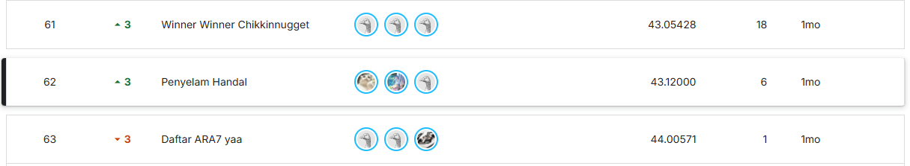

# Penyelam Handal - Hology 8.0 2025 Data Mining

## Hasil Perlombaan
#### Link Leaderboard
https://www.kaggle.com/competitions/penyisihan-hology-8-0-2025-data-mining/leaderboard


## Deskripsi Proyek
Repository ini berisi solusi untuk kompetisi **Hology 8.0 2025 Data Mining** yang berfokus pada **crowd counting** (penghitungan kerumunan) menggunakan deep learning. Kami mengimplementasikan model CSRNet (Crowd Scene Recognition Network) untuk menghitung jumlah orang dalam gambar secara otomatis.

## Tim Penyelam Handal
Proyek ini dikembangkan oleh tim Penyelam Handal yang terdiri dari:
- **Muhammad Rafi Rajendra** 
- **Varizky Naldiba Rimra** 
- **Octrian Adiluhung Tito Putra** 

## Tujuan
Mengembangkan model deep learning yang dapat secara akurat menghitung jumlah orang dalam gambar kerumunan dengan menggunakan teknik density map estimation.

## Arsitektur Model

### CSRNet (Crowd Scene Recognition Network)
Kami mengimplementasikan **tiga varian CSRNet**:

1. **Standard CSRNet**
   - Frontend: VGG-16 based (64, 64, M, 128, 128, M, 256, 256, 256, M, 512, 512, 512)
   - Backend: Dilated convolutions (512, 512, 512, 256, 128, 64)
   - Learning rate: 1e-5

2. **Deeper CSRNet**
   - Frontend: Extended VGG with additional layers
   - Backend: Deeper backend network (512, 512, 512, 512, 256, 128, 64)
   - Learning rate: 5e-6

3. **Wider CSRNet**
   - Frontend: Wider channels (96, 96, M, 192, 192, M, 384, 384, 384, M, 768, 768, 768)
   - Backend: Wider backend (768, 512, 512, 256, 128, 64)
   - Learning rate: 8e-6

### Ensemble Model
Kami menggabungkan prediksi dari ketiga varian model untuk meningkatkan akurasi dan robustness.

## Dataset
- **Sumber**: Dataset kompetisi Hology 8.0 2025 Data Mining
- **Training Images**: 80% dari total dataset
- **Validation Images**: 20% dari total dataset
- **Test Images**: Dataset terpisah untuk evaluasi final
- **Format Label**: JSON dengan koordinat titik (x, y) untuk setiap orang

## Preprocessing & Augmentasi Data

### Transformasi Data Training
- Resize ke 224x224 pixels
- Random horizontal flip (p=0.5)
- Random resized crop (scale: 0.8-1.0, ratio: 0.8-1.2)
- Color jitter:
  - Brightness: ±20%
  - Contrast: ±20%
  - Saturation: ±10%
  - Hue: ±5%
- Normalization dengan ImageNet statistics

### Transformasi Data Validation/Test
- Resize ke 224x224 pixels
- Normalization dengan ImageNet statistics

### Density Map Generation
- **Metode**: Gaussian kernel convolution
- **Sigma**: 3-4 pixels
- **Output size**: 28x28 (downsampled dari 224x224)
- Setiap titik annotasi dikonversi menjadi Gaussian blob untuk representasi density

## Implementasi

### Dependencies
```python
- torch
- torchvision
- numpy
- opencv-python
- matplotlib
- Pillow
- tqdm
- pandas
- json
```

### Struktur Kode Utama

#### 1. **Model Architecture** (`CSRNet` class)
- Frontend: VGG-16 inspired feature extractor
- Backend: Dilated convolutional layers
- Output: Single channel density map
- Weight initialization: Normal distribution & VGG-16 pretrained weights

#### 2. **Dataset Handler** (`DensityMapDataset` class)
- Membaca gambar dan label JSON
- Generate density map on-the-fly
- Menerapkan transformasi data
- Support untuk train/val/test splits

#### 3. **Training Loop**
- Loss function: MSE (Mean Squared Error)
- Optimizer: Adam dengan weight decay (1e-4)
- Scheduler: StepLR (step_size=10, gamma=0.1)
- Batch size: 4
- Epochs: 40

## Hasil Training

### Metrics yang Digunakan
- **MAE (Mean Absolute Error)**: Rata-rata error absolut
- **RMSE (Root Mean Squared Error)**: Root mean squared error
- **MAPE (Mean Absolute Percentage Error)**: Persentase error rata-rata
- **Pearson Correlation**: Korelasi antara prediksi dan ground truth

### Analisis Kategori Density
Kami menganalisis performa model berdasarkan tingkat kepadatan:
- **Low Density**: 0-10 orang
- **Medium Density**: 11-50 orang
- **High Density**: >50 orang

## Struktur Repository

```
PenyelamHandal_Hology/
├── Penyelam_Handal.ipynb          # Notebook utama dengan implementasi lengkap
├── idk.ipynb                      # Eksperimen dan testing
├── idk.py                         # Script Python tambahan
├── PenyelamHandal.pth             # Model weights utama
├── README.md                      # Dokumentasi proyek
├── density_maps/                  # Pre-computed density maps
│   ├── *_density.npy              # Density map arrays
│   └── *_metadata.json            # Metadata untuk setiap density map
├── Model/
│   └── best_csrnet_model.pth      # Best performing model
├── penyisihan-hology-8-0-2025-data-mining/
│   ├── train/
│   │   ├── images/                # Training images
│   │   └── labels/                # Training labels (JSON)
│   ├── test/
│   │   └── images/                # Test images
│   └── sample_submission.csv      # Format submission
├── TrainRafi/                     # Hasil eksperimen Rafi
│   ├── test_predictions.csv       # Prediksi test set
│   └── detailed_test_predictions.csv
├── TrainRizky/                    # Hasil eksperimen Rizky
│   ├── NoteBook_Rizky.ipynb       # Notebook eksperimen
│   ├── Penyelam_handal_1.csv      # Submission file
│   ├── detailed_test_predictions.csv
│   └── final_evaluation_results.json
└── TrainTito/                     # Hasil eksperimen Tito
    ├── Untitled1.ipynb            # Notebook eksperimen
    ├── penyelam_handal3.csv       # Submission file
    ├── best_csrnet_model.pth      # Model weights
    └── final_evaluation_results.json
```

## Cara Menggunakan

### 1. Setup Environment
```bash
pip install torch torchvision matplotlib opencv-python pillow tqdm pandas
```

### 2. Training Model
```python
# Buka Penyelam_Handal.ipynb
# Jalankan semua cell secara berurutan
# Model akan di-train dengan 3 varian dan disimpan otomatis
```

### 3. Evaluasi Model
```python
# Model akan dievaluasi pada validation set
# Metrics (MAE, RMSE, MAPE) akan ditampilkan
# Visualisasi prediksi vs ground truth
```

### 4. Prediksi pada Test Set
```python
# Model akan memproses semua test images
# Output: test_predictions.csv dan detailed_test_predictions.csv
```

## Hasil Evaluasi Model

Berdasarkan evaluasi pada 200 sample images:

### Overall Metrics
- **MAE (Mean Absolute Error)**: 61.91
- **RMSE (Root Mean Squared Error)**: 94.75
- **MAPE (Mean Absolute Percentage Error)**: 150.60%
- **Pearson Correlation**: 0.97

### Performance by Density Category
- **Low Density (0-10 orang)**: 
  - MAE: 16.38, RMSE: 16.83
  - 55 images dalam kategori ini
- **Medium Density (11-50 orang)**: 
  - MAE: 30.47, RMSE: 40.46
  - 59 images dalam kategori ini
- **High Density (>50 orang)**: 
  - MAE: 112.61, RMSE: 139.91
  - 86 images dalam kategori ini

### Dataset Range
- Ground truth: 2 - 2,153 orang
- Predictions: 16.07 - 1,965.95 orang

## Output Files

### 1. Model Weights
- `PenyelamHandal.pth`: Model utama hasil training
- `Model/best_csrnet_model.pth`: Best performing model checkpoint

### 2. Predictions
Setiap anggota tim menghasilkan file prediksi:
- **TrainRafi**: `test_predictions.csv`, `detailed_test_predictions.csv`
- **TrainRizky**: `Penyelam_handal_1.csv`, `detailed_test_predictions.csv`
- **TrainTito**: `penyelam_handal3.csv`

### 3. Evaluation Results
- `TrainRizky/final_evaluation_results.json`: Hasil evaluasi lengkap dengan metrics
- `TrainTito/final_evaluation_results.json`: Hasil evaluasi model Tito

### 4. Density Maps (Pre-computed)
- Directory `density_maps/` berisi pre-computed density maps untuk mempercepat training
- Format: `.npy` untuk array dan `.json` untuk metadata

## Visualisasi

Notebook kami menyediakan visualisasi untuk:
1. **Sample Images dengan Annotations**: Menampilkan gambar dan jumlah orang
2. **Data Transformations**: Before/after augmentasi
3. **Density Maps**: Ground truth dan predicted density maps
4. **Training Progress**: Loss curves untuk train dan validation
5. **Model Comparison**: Perbandingan performa antar varian model
6. **Test Predictions**: Sample prediksi pada test set

## Key Features

- **Multi-variant Ensemble**: Tiga varian CSRNet untuk robustness
- **Advanced Augmentation**: Color jitter, random crop, horizontal flip
- **Density Map Estimation**: Gaussian-based density map generation
- **Transfer Learning**: VGG-16 pretrained weights untuk frontend
- **Comprehensive Evaluation**: Multiple metrics dan category analysis
- **Batch Processing**: Efficient batch processing untuk training dan inference
- **Automatic Model Saving**: Best model checkpoint berdasarkan validation loss

## Lessons Learned

1. **Density Map Quality**: Kualitas density map sangat mempengaruhi akurasi model
2. **Ensemble Benefits**: Menggabungkan multiple models meningkatkan robustness
3. **Data Augmentation**: Random augmentation membantu model generalize better
4. **Scale Consistency**: Resize yang konsisten antara training dan testing penting
5. **Learning Rate Tuning**: Different architectures memerlukan learning rate yang berbeda
6. **High Density Challenge**: Model cenderung kurang akurat pada gambar dengan kepadatan sangat tinggi (>50 orang)
7. **Correlation vs Error**: Meskipun correlation tinggi (0.97), MAE masih cukup besar terutama untuk high-density crowds

## Eksperimen Tim

Setiap anggota tim melakukan eksperimen independen dengan hasil:
- **TrainRafi**: Menghasilkan predictions untuk test set
- **TrainRizky**: Evaluasi komprehensif dengan MAE 61.91, menghasilkan submission `Penyelam_handal_1.csv`
- **TrainTito**: Eksperimen alternatif dan menghasilkan submission `penyelam_handal3.csv`

## Future Improvements

- Implementasi attention mechanisms
- Multi-scale feature extraction
- Advanced loss functions (Focal loss, etc.)
- Post-processing techniques
- Real-time inference optimization
- Mobile deployment

## Contact

Untuk pertanyaan atau kolaborasi, silakan hubungi tim Penyelam Handal melalui repository ini.

---

**Hology 8.0 2025 - Data Mining Competition**  
**Tim Penyelam Handal**
